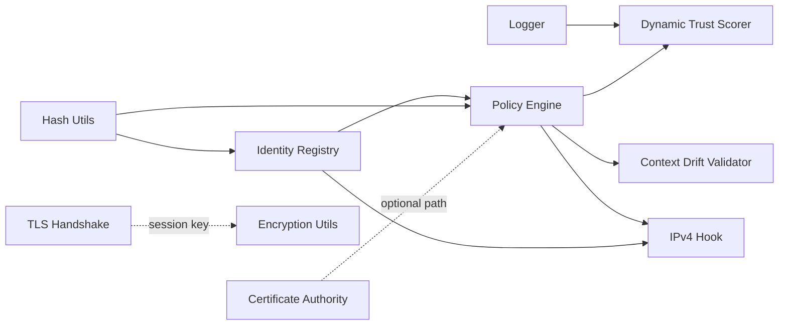

# Model Overview

The `model/` folder is the actual Zero Trust engine: identity, policy, certificates, encryption, hashing, context-drift revalidation, dynamic trust scoring, TLS-style handshakes, logging, and the IPv4 enforcement hook. Every class here is plain, reusable C++ (an `ns3::Object` where it needs to plug into the simulator) with no example-specific logic.

## Modules

- **[Identity Registry](zt-identity-registry.md)** — Singleton mapping each node to its role and a SHA-256 identity hash.
- **[Hash Utilities](zt-hash-utils.md)** — One free function: hex-encoded SHA-256 digests.
- **[Certificate Authority & Certificate-Based Policy](zt-certificate.md)** — A simulated Certificate Authority that signs and verifies node identity certificates.
- **[Policy Engine](zt-policy-engine.md)** — The central authorization + micro-segmentation decision point; defaults to DENY.
- **[Context Drift Validator](zt-context-drift-validator.md)** — Continuously re-scores trust as a node's live context drifts from its baseline.
- **[Dynamic Trust Scorer (DTS)](zt-dynamic-trust-scorer.md)** — Per-session anomaly scoring based on deviation from a learned packet-rate baseline.
- **[Encryption Utilities](zt-encryption-utils.md)** — AES-CBC payload encryption/decryption and hex key helpers.
- **[TLS Handshake](zt-tls-handshake.md)** — Policy-gated handshake that establishes a shared AES session key between two nodes.
- **[IPv4 Enforcement Hook](zt-ipv4-hook.md)** — Taps a node's IPv4 Tx trace so policy decisions are enforced on real outgoing packets.
- **[Logger](zt-logger.md)** — Shared static logging façade with optional timestamps used across all modules.

## How the pieces fit together

